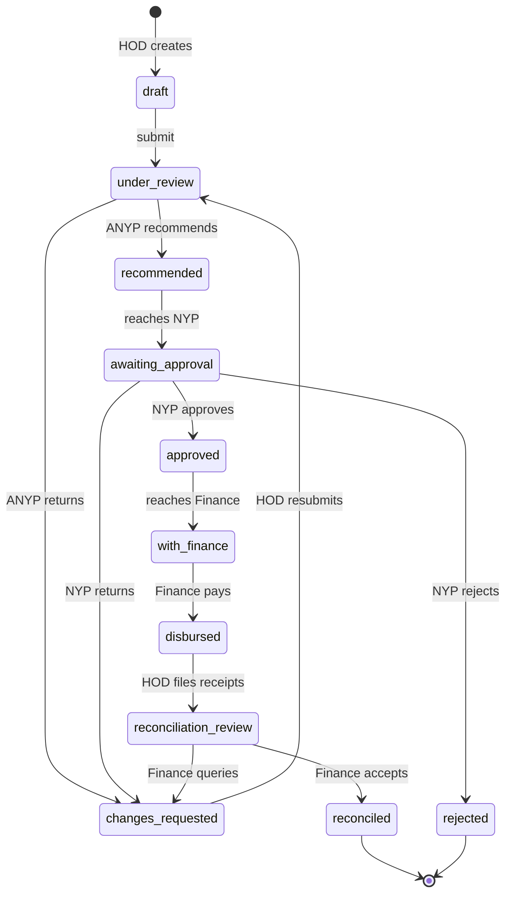
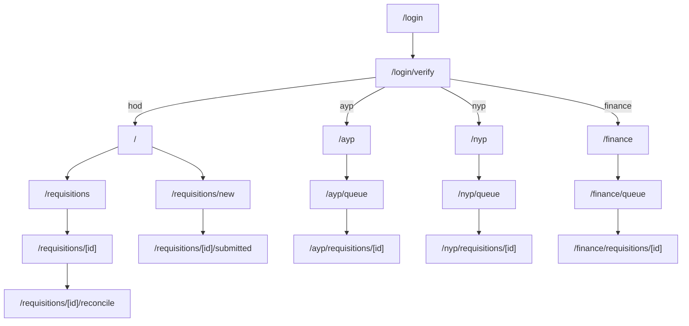

# 03 — App Flow

**Related:** [01-PRD.md](01-PRD.md) · [04-UI-UX-Design-Brief.md](04-UI-UX-Design-Brief.md)

Every screen listed here exists. What does **not** yet exist is the server behind them: the
screens read and write the browser's own storage, and sign-in is a choice rather than a check
(see [06-Implementation-Plan.md](06-Implementation-Plan.md)).

## 1. The workflow

Eleven states, and **five stages** shown to the user: `submitted → recommended → approval →
disbursement → reconciled`. Approval and payment are one stage on purpose — Finance processes
an approved requisition rather than re-verifying it.

## 2. Screens

29 in total. Each reviewer role has its own area rather than one screen behaving four ways.

### Shared
| Route | Purpose |
| --- | --- |
| `/login` | Email address; sends a single-use link *(prototype: lists accounts)* |
| `/login/verify` | "Check your email" holding screen |

### Head of Department
| Route | Purpose |
| --- | --- |
| `/` | Dashboard: what needs attention, totals, recent requests |
| `/requisitions` | Their own requisitions, searchable |
| `/requisitions/new` | Raise one: programme, date, location, purpose, expense lines |
| `/requisitions/[id]` | Detail: stages, items, comments, activity |
| `/requisitions/[id]/submitted` | Confirmation after submitting |
| `/requisitions/[id]/reconcile` | Actual spend per line, receipts, note |
| `/reports` · `/settings` · `/profile` | Reports with CSV/print; preferences; own details |

### Reviewers — `/ayp`, `/nyp`, `/finance`
Each has the same five: a dashboard, a **queue** (oldest waiting first), a requisition detail
with the actions that role may take, reports, settings and profile.

## 3. Navigation

A persistent left sidebar carries Home, Requisitions/Queue, Reports, Settings and Profile,
with the signed-in person at the foot. A top bar holds search and the primary action for that
role — **New Requisition** for a HOD, the review action for everyone else.

## 4. Key flows

**Raising one.** `/requisitions/new` → fill programme details and expense lines → submit →
`/requisitions/[id]/submitted` confirms → status becomes `under_review` and it appears in the
ANYP queue.

**Reviewing.** Queue, oldest first → open → **Recommend**, or **Return with changes**, which
requires naming the specific changes rather than a bare comment. A returned requisition goes
back to the HOD as `changes_requested` with those points attached.

**Paying.** Finance opens an approved requisition → records the transfer reference →
`disbursed`. It now appears among the disbursements awaiting reconciliation.

**Closing.** HOD enters what each line actually cost and attaches receipts → variance is
computed (positive means money to return, negative an overspend) → Finance accepts and it
becomes `reconciled`, or queries it back.

## 5. What is real, and what is not

Real as of phase 3:

- **Sign-in.** One path only: a single-use link, sent by email, that opens a genuine session.
  There is no way to sign in as somebody else.
- **The data.** One shared database. What you see is scoped server-side to what you may see.
- **The rules.** Every move is checked by the server; the screens only draw the buttons.

Still not real:

- **Attachments are names only.** No file is uploaded or stored — phase 4. This matters most
  for receipts, which are the basis of reconciliation.
- **Notifications.** Nothing tells you something is waiting; you have to look — phase 5.
